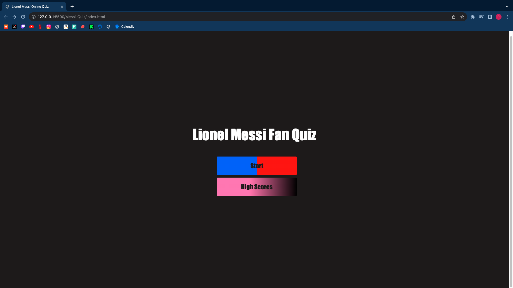
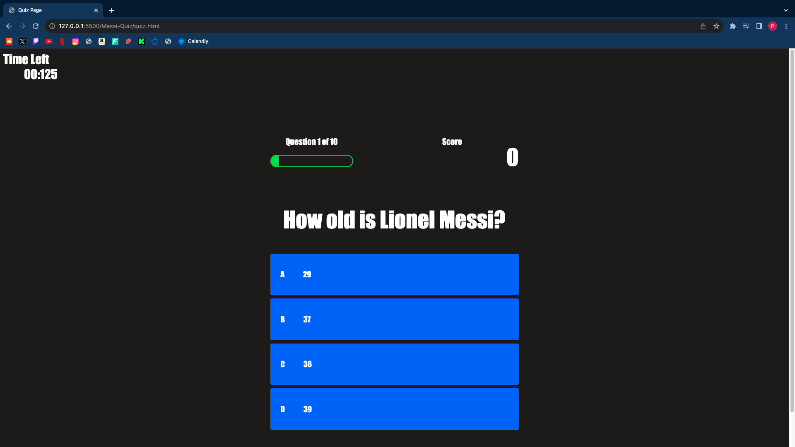
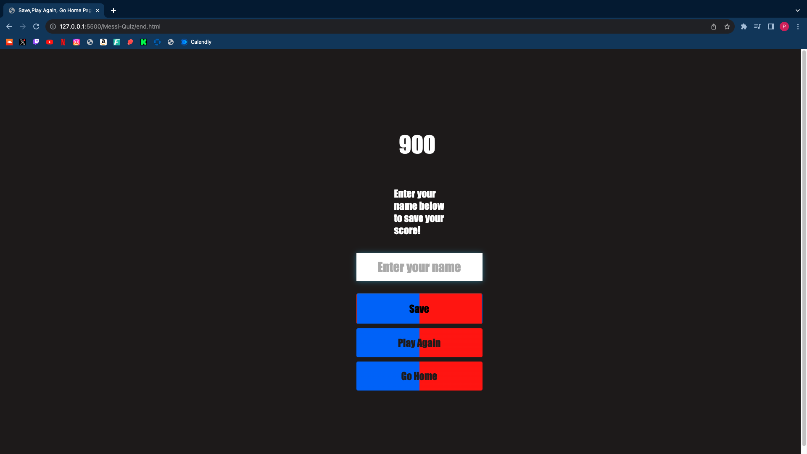
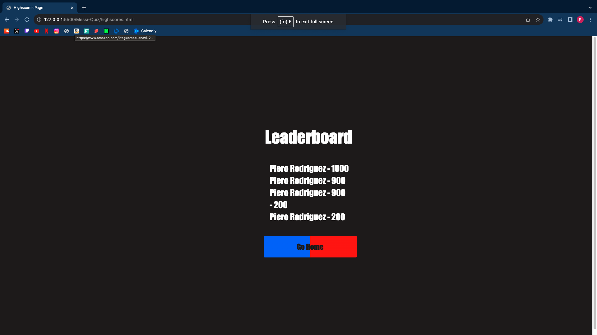

# Messi-Quiz
Week 4 Homework assignment

#Description 

My motivation throughout this project was to demonstrate all the skills that I have learned throughout this bootcamp, even though I still have a lot left to practice and learn I still came a long way from the first day of bootcamp. I built this project about Lionel Messi to show a side personal side of me to show potiential employers what my interests are and also to show who I am as a person. The problem that this Lionel Messi quiz is boredom, when a person is bored one can play this quiz for fun and enjoy more knowledge about Lionel Messi. Another problem that it can solve is people can determine who is the better Lionel Messi fan by beating others high scores in this quiz. I learnt a lot throughout the process of making this quiz. The most immportant things I have learned was how to subtract time from a timer when a user answers a question wrong. Another useful thing I learned was new ways to write funtions and how to shorten specific elements in javascript. 

#Installation 
There were a lot of steps that were required to create this Lionel Messi quiz. To start off I had to create a start menu page where the user can start the quiz. Then I had to create the quiz itself by creating another html file, javascript file, and css file; what I did there was add a lot of stying to the questions and expand on their functionality by including javascript. The next step was to create another new set of files to create the end of the quiz where the user can enter their name to save their score and then return to the menu. The last step was to create a new set of files to make the highscores page where the user can see the high score leaderboard. 

#Usage 
1. The user will be firstly introduced by the starter quiz page which they could either start the quiz or have the option to view the high scores

2. The user will be presented with the quiz once they hit the "Start" button in the main page. Then they can commence answering the randomized questions presented to them. There is a timer that start with 140 seconds which is the time that the user has to complete the quiz. The timer also has the functionality of decreasing 10 seconds from the timer when the user answers a question wrong and they can still continue the quiz but when the user answers the questions correctly nothing will happen they will just continue on with the quiz. When the user answer a question correctly then the answer that they chose will have the background color of green but if they answer wrong then the background color of the wrong answer will be red. There also a progress bar beneath the timer and the progress shows the progress of the user to let them know what question they are on. The last feature is the score, the score that user has will be presented on the top right as they progress throughout the quiz. 

3. When the user finishes the quiz then they will be presented with 3 options. They can choose to enter their name to register their high score but they must click save to view their high score in the leaderboard. The other options they are preseneted with is choosing to play again or back to the Starter page of the quiz. The number displayed at the top shows the score of the user. 

4. Once the user clicks save then they will be brought to the Starter page where they were previously presented with the options "Start" or "View High scores". If the user wants to see the leaderboard to see if they are up there then they would need to click "View High scores".

5. Once the user clicks "View High scores" they will be presented with the players names with the highest score. The leaderboard consists of the 5 top players with the highest scores. The user will also be presented with the option to go back to the starter page as well. 

#Credits 
This Lionel Messi Quiz was created by Piero Rodriguez (Github account = https://github.com/Piero9992023)

Live Server Link = https://piero9992023.github.io/Messi-Quiz/
